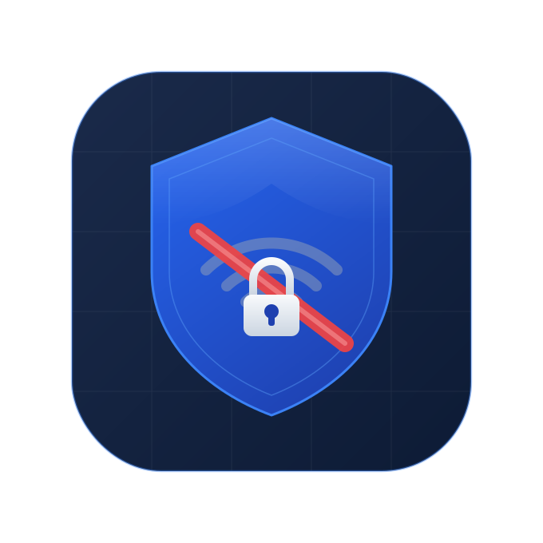

<div align="center">



# HotspotGuard

**EN** · [DE](#deutsch)

*Parental control app that prevents children from enabling the Wi-Fi hotspot on Android devices managed with Google Family Link.*

---

</div>

## English

### Overview

HotspotGuard is a password-protected Android app designed to silently run in the background and block any attempt to enable the device's Wi-Fi hotspot. It is built to coexist with Google Family Link without being killed or circumvented by the child.

### How It Works

HotspotGuard uses a layered defence strategy:

| Layer | Mechanism | Effect |
|---|---|---|
| **Device Owner** *(recommended)* | `DISALLOW_CONFIG_TETHERING` via `DevicePolicyManager` | Hotspot UI is greyed out system-wide — completely preventive |
| **Accessibility Service** | Monitors Settings UI, flips the toggle back | Reactive — catches toggle activation in system settings |
| **Foreground Service** | Polls hotspot state every 750 ms + `ContentObserver` | Reactive — detects and attempts to stop an active hotspot |
| **VPN Process Shield** | Dummy VPN keeps process priority at highest level | Prevents Family Link from killing the app process |
| **Boot Receiver** | Starts automatically after reboot or app update | Ensures persistent protection |

> **Important:** On Android 13+, no normal app API can programmatically stop a user-initiated hotspot without `TETHER_PRIVILEGED` (a system-only permission). **Device Owner mode is the only fully reliable solution.** The other layers provide best-effort reactive protection.

### Requirements

- Android 12 (API 31) or higher
- A PC with ADB for the one-time Device Owner setup *(recommended)*
- USB Debugging enabled on the device *(for Device Owner setup)*

### Setup

#### 1. Install the App
Build and install the APK via Android Studio or `adb install`.

#### 2. Set a Password
On first launch, you will be prompted to set a password of at least 4 characters. This password protects access to all app settings.

#### 3. Enable Device Owner Mode *(strongly recommended)*

This is a one-time step performed by the parent. It gives the app the ability to permanently disable the hotspot UI at the system level.

**Prerequisites:**
- USB Debugging must be enabled on the child's device *(Settings → Developer Options → USB Debugging)*
- [Android Platform Tools](https://developer.android.com/tools/releases/platform-tools) installed on the parent's PC

**Command** *(run once from a PC terminal with the device connected via USB)*:
```bash
adb shell dpm set-device-owner com.tvcs.hotspotguard/.DeviceAdminReceiver
```

After running the command, open the HotspotGuard dashboard and tap **"Check"** — the status will update to **"Fully Locked"**.

> ⚠️ Device Owner mode can only be set on a device with **no secondary accounts** (Google accounts). If the command fails, go to Settings → Accounts and remove all accounts except the primary one, then retry. You can re-add accounts afterwards.

#### 4. Enable the Accessibility Service
In the dashboard, enable the **Accessibility Service** toggle. Follow the prompt to:
*Settings → Accessibility → HotspotGuard → Enable*

This adds a reactive layer that catches hotspot activation attempts directly in the settings UI.

#### 5. Enable VPN Process Shield *(optional)*
Toggle on **VPN Process Shield** in the dashboard. This elevates the app's process priority, making it harder for Family Link to terminate the background service. A one-time VPN permission dialog will appear — this VPN routes no actual traffic.

### App Screens

| Screen | Description |
|---|---|
| **Login** | Password entry on every app open. Shows current guard status and blocked attempt count. |
| **Dashboard** | Main control panel — service toggles, blocked attempt counter, Device Owner setup wizard, password change. |

### Resetting the App
If you need to start over (e.g. forgotten password), tap **"Reset App"** on the login screen. This clears all saved data and returns the app to the initial setup state.

> Note: Device Owner mode is not removed by a reset. To remove it, run: `adb shell dpm remove-active-admin com.tvcs.hotspotguard/.DeviceAdminReceiver`

### Permissions

| Permission | Reason |
|---|---|
| `ACCESS_WIFI_STATE` / `CHANGE_WIFI_STATE` | Read and attempt to change hotspot state |
| `CHANGE_NETWORK_STATE` | Required for `TetheringManager` calls |
| `FOREGROUND_SERVICE` | Keep the monitoring service alive |
| `RECEIVE_BOOT_COMPLETED` | Auto-start after reboot |
| `BIND_VPN_SERVICE` | Process shield (no traffic routed) |
| `WAKE_LOCK` | Prevent CPU sleep during monitoring |
| `POST_NOTIFICATIONS` | Status and alert notifications |
| `BIND_DEVICE_ADMIN` | Device Owner mode |
| `BIND_ACCESSIBILITY_SERVICE` | UI-level hotspot toggle detection |

### Architecture

```
com.tvcs.hotspotguard/
├── MainActivity.kt              — Entry point, routes to setup or login
├── PasswordActivity.kt          — Login / setup / change / reset
├── DashboardActivity.kt         — Main settings and status screen
├── HotspotGuardService.kt       — Core foreground monitoring service
├── HotspotAccessibilityService.kt — UI-level toggle interception
├── ProtectionVpnService.kt      — Dummy VPN for process priority
├── DeviceAdminReceiver.kt       — Device Owner / policy enforcement
├── HotspotReceiver.kt           — Broadcast receiver for AP state changes
├── BootReceiver.kt              — Auto-start on boot
└── SecurityPrefs.kt             — AES-256-GCM encrypted preferences
                                   (Android Keystore, no external library)
```

### Tech Stack

- **Language:** Kotlin
- **Min SDK:** 31 (Android 12)
- **Target SDK:** 34 (Android 14)
- **Encryption:** Android Keystore + AES-256-GCM (javax.crypto, no third-party library)
- **UI:** Material Components 3, ViewBinding
- **Dependencies:** AndroidX Core, AppCompat, Material, CardView, Lifecycle, Activity KTX

### Known Limitations

- On Android 13+ without Device Owner mode, a determined child can activate the hotspot via the Quick Settings panel before the reactive service can respond.
- Device Owner mode requires no secondary Google accounts on the device at setup time.
- Some OEM Settings apps (Xiaomi MIUI, etc.) may use non-standard view IDs that reduce Accessibility Service effectiveness.

---

<div align="center">

**[EN](#english)** · DE

</div>

---

## Deutsch

### Übersicht

HotspotGuard ist eine passwortgeschützte Android-App, die im Hintergrund läuft und jeden Versuch blockiert, den WLAN-Hotspot des Geräts zu aktivieren. Die App ist dafür ausgelegt, mit Google Family Link zusammenzuarbeiten, ohne von diesem beendet oder umgangen werden zu können.

### Funktionsweise

HotspotGuard verwendet eine mehrschichtige Schutzstrategie:

| Schicht | Mechanismus | Wirkung |
|---|---|---|
| **Device Owner** *(empfohlen)* | `DISALLOW_CONFIG_TETHERING` via `DevicePolicyManager` | Hotspot-UI systemweit ausgegraut — vollständig präventiv |
| **Accessibility-Service** | Überwacht die Einstellungs-UI, klappt Toggle zurück | Reaktiv — erkennt Aktivierungsversuche in den Systemeinstellungen |
| **Foreground-Service** | Prüft Hotspot-Status alle 750 ms + `ContentObserver` | Reaktiv — erkennt und versucht aktiven Hotspot zu deaktivieren |
| **VPN-Prozessschutz** | Dummy-VPN hält Prozessprioriät auf höchstem Level | Verhindert, dass Family Link den App-Prozess beendet |
| **Boot-Receiver** | Startet automatisch nach Neustart oder App-Update | Dauerhafter Schutz sichergestellt |

> **Wichtig:** Auf Android 13+ kann keine normale App einen vom Nutzer gestarteten Hotspot programmatisch stoppen — dafür wäre `TETHER_PRIVILEGED` nötig, eine systemexklusive Permission. **Der Device-Owner-Modus ist die einzige vollständig zuverlässige Lösung.** Die anderen Schichten bieten reaktiven Best-Effort-Schutz.

### Voraussetzungen

- Android 12 (API 31) oder neuer
- PC mit ADB für die einmalige Device-Owner-Einrichtung *(empfohlen)*
- USB-Debugging auf dem Gerät aktiviert *(für Device Owner)*

### Einrichtung

#### 1. App installieren
APK über Android Studio bauen und installieren oder per `adb install` übertragen.

#### 2. Passwort festlegen
Beim ersten Start wird ein Passwort mit mindestens 4 Zeichen festgelegt. Dieses schützt den Zugang zu allen App-Einstellungen.

#### 3. Device-Owner-Modus aktivieren *(dringend empfohlen)*

Dies ist ein einmaliger Schritt, den der Elternteil durchführt. Er gibt der App die Möglichkeit, die Hotspot-Funktion auf Systemebene dauerhaft zu sperren.

**Voraussetzungen:**
- USB-Debugging muss auf dem Kindergerät aktiviert sein *(Einstellungen → Entwickleroptionen → USB-Debugging)*
- [Android Platform Tools](https://developer.android.com/tools/releases/platform-tools) auf dem PC des Elternteils installiert

**Befehl** *(einmalig im Terminal ausführen, Gerät per USB verbunden)*:
```bash
adb shell dpm set-device-owner com.tvcs.hotspotguard/.DeviceAdminReceiver
```

Nach dem Ausführen die HotspotGuard-App öffnen und auf **„Prüfen"** tippen — der Status wechselt zu **„Vollständig gesperrt"**.

> ⚠️ Der Device-Owner-Modus kann nur auf einem Gerät ohne Zweit-Accounts (Google-Konten) eingerichtet werden. Falls der Befehl fehlschlägt: Einstellungen → Konten → alle Konten außer dem Hauptkonto entfernen, dann erneut versuchen. Anschließend können die Konten wieder hinzugefügt werden.

#### 4. Accessibility-Service aktivieren
Im Dashboard den Schalter **Accessibility-Service** einschalten und dem Hinweis folgen:
*Einstellungen → Eingabehilfe → HotspotGuard → Aktivieren*

Dies fügt eine reaktive Schicht hinzu, die Aktivierungsversuche direkt in der Einstellungs-UI abfängt.

#### 5. VPN-Prozessschutz aktivieren *(optional)*
Im Dashboard **VPN-Prozessschutz** einschalten. Dies erhöht die Prozesspriorität der App und macht es schwieriger für Family Link, den Hintergrundservice zu beenden. Ein einmaliger VPN-Berechtigungsdialog erscheint — dieses VPN leitet keinen echten Datenverkehr um.

### App-Screens

| Screen | Beschreibung |
|---|---|
| **Login** | Passwort-Eingabe bei jedem App-Start. Zeigt aktuellen Schutzstatus und Anzahl blockierter Versuche. |
| **Dashboard** | Zentrale Steuerkonsole — Service-Schalter, Blockierzähler, Device-Owner-Einrichtungsassistent, Passwort ändern. |

### App zurücksetzen
Falls ein Neustart nötig ist (z.B. Passwort vergessen), auf **„App zurücksetzen"** im Login-Screen tippen. Dadurch werden alle gespeicherten Daten gelöscht und die App kehrt in den Einrichtungszustand zurück.

> Hinweis: Der Device-Owner-Modus wird durch einen Reset nicht entfernt. Zum Entfernen: `adb shell dpm remove-active-admin com.tvcs.hotspotguard/.DeviceAdminReceiver`

### Berechtigungen

| Berechtigung | Grund |
|---|---|
| `ACCESS_WIFI_STATE` / `CHANGE_WIFI_STATE` | Hotspot-Status lesen und Änderung versuchen |
| `CHANGE_NETWORK_STATE` | Benötigt für `TetheringManager`-Aufrufe |
| `FOREGROUND_SERVICE` | Monitoring-Service am Leben erhalten |
| `RECEIVE_BOOT_COMPLETED` | Autostart nach Neustart |
| `BIND_VPN_SERVICE` | Prozessschutz (kein Traffic) |
| `WAKE_LOCK` | CPU-Schlaf während Überwachung verhindern |
| `POST_NOTIFICATIONS` | Status- und Alarm-Benachrichtigungen |
| `BIND_DEVICE_ADMIN` | Device-Owner-Modus |
| `BIND_ACCESSIBILITY_SERVICE` | Hotspot-Toggle-Erkennung auf UI-Ebene |

### Architektur

```
com.tvcs.hotspotguard/
├── MainActivity.kt              — Einstiegspunkt, leitet zu Setup oder Login
├── PasswordActivity.kt          — Login / Einrichten / Ändern / Zurücksetzen
├── DashboardActivity.kt         — Haupteinstellungen und Statusanzeige
├── HotspotGuardService.kt       — Kern-Foreground-Überwachungsservice
├── HotspotAccessibilityService.kt — Toggle-Abfang auf UI-Ebene
├── ProtectionVpnService.kt      — Dummy-VPN für Prozesspriorität
├── DeviceAdminReceiver.kt       — Device Owner / Richtliniendurchsetzung
├── HotspotReceiver.kt           — Broadcast-Receiver für AP-Statusänderungen
├── BootReceiver.kt              — Autostart nach Neustart
└── SecurityPrefs.kt             — AES-256-GCM-verschlüsselte Einstellungen
                                   (Android Keystore, keine externe Bibliothek)
```

### Tech-Stack

- **Sprache:** Kotlin
- **Min SDK:** 31 (Android 12)
- **Target SDK:** 34 (Android 14)
- **Verschlüsselung:** Android Keystore + AES-256-GCM (javax.crypto, keine Drittanbieter-Bibliothek)
- **UI:** Material Components 3, ViewBinding
- **Abhängigkeiten:** AndroidX Core, AppCompat, Material, CardView, Lifecycle, Activity KTX

### Bekannte Einschränkungen

- Auf Android 13+ ohne Device-Owner-Modus kann ein entschlossenes Kind den Hotspot über die Schnelleinstellungen aktivieren, bevor der reaktive Service reagieren kann.
- Der Device-Owner-Modus erfordert beim Einrichten, dass keine Zweit-Google-Konten auf dem Gerät vorhanden sind.
- Einige Hersteller-Einstellungs-Apps (Xiaomi MIUI u.a.) verwenden nicht-standardisierte View-IDs, die die Wirksamkeit des Accessibility-Service verringern können.

---

<div align="center">
<sub>HotspotGuard — Built with Kotlin for Android 12+</sub>
</div>
